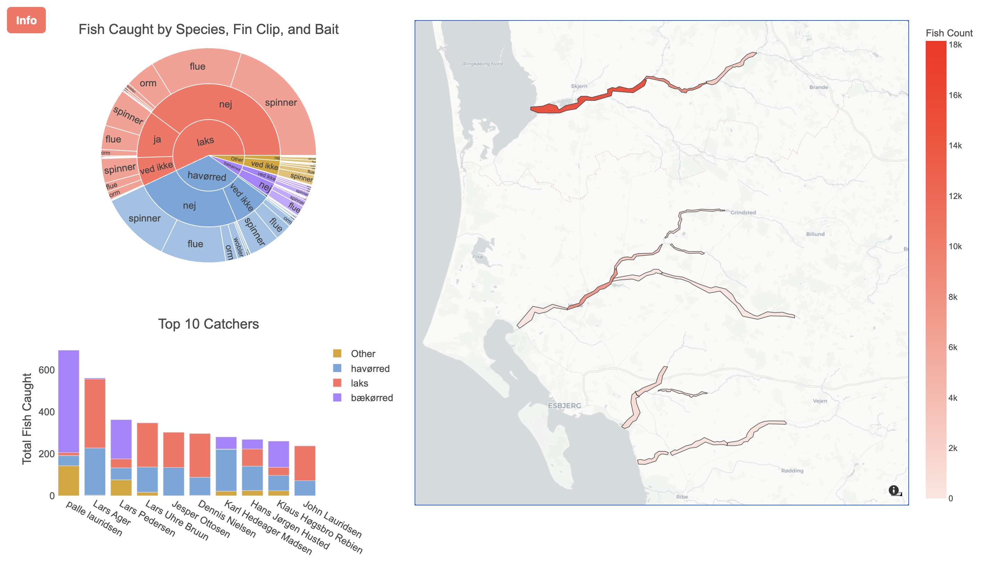
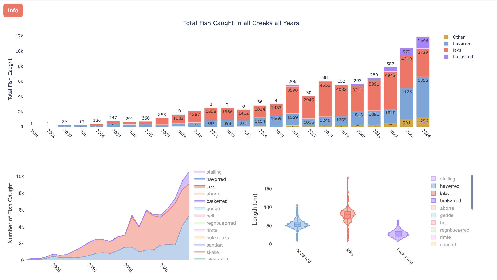

# Fish Visualization

An interactive Dash app for visualizing fish catches in Danish creeks.  
The project scrapes open-access catch reports from various sources and presents them through interactive visualizations including maps, charts, and plots.  

---

## Data Sources

The dataset was scraped from the following open-access sources:  

- [Skjern Å Sammenslutningen](https://skjernaasam.dk/fangstjournalen/fangststatistik-laks/)  
  • Omme Å, Skjern Å, Vorgod Å  

- [HOF Storå](https://www.hof-storaa.dk/forside/fangstrapporter/her-foelger-du-de-seneste-fangster-i-storaaen)  
  • Råsted lilleå, Storå, Vandkraftsøen, Vegen Å  

- [DTU Fangstjournalen (assoc=93E4A686EE90DB00C125861B0065E0A1)](https://fangstjournalen.dtu.dk/fangst.nsf/iframe.xsp?open&assoc=93E4A686EE90DB00C125861B0065E0A1&type=1&year)  
  • Ansager Å, Grene Å, Grindsted Å, Holme Å, Linding Å, Varde Å  

- [DTU Fangstjournalen (assoc=15CA9C7E946A36A9C12585450030D129)](https://fangstjournalen.dtu.dk/fangst.nsf/iframe.xsp?open&assoc=15CA9C7E946A36A9C12585450030D129&type=1)  
  • Konge Å, Vejen Å  

- [DTU Fangstjournalen (assoc=546F2600F0210439C12585450030B71E)](https://fangstjournalen.dtu.dk/fangst.nsf/iframe.xsp?open&assoc=546F2600F0210439C12585450030B71E&type=1)  
  • Holsted Å, Snerum Å  

- [DTU Fangstjournalen (assoc=D08D3801635DFBC2C125881500629D3A)](https://fangstjournalen.dtu.dk/fangst.nsf/iframe.xsp?open&assoc=D08D3801635DFBC2C125881500629D3A&type=1)  
  • Fladså, Gels Å, Gram Å, Hjortvad Å, Jels Å, Nørreå, Ribe Å  

- [DTU Fangstjournalen (club=8A8C2EF4F75BD1ACC1257C2000780941)](https://fangstjournalen.dtu.dk/fangst.nsf/iframe.xsp?open&club=8A8C2EF4F75BD1ACC1257C2000780941&type=1)  
  • Holtum Å, Karup Å, Omme Å, Råsted lilleå, Skjern Å, Storå, Tissø, Vorgod Å  

- [DTU Fangstjournalen (assoc=E712C7DB2541E9A7C125881B001EB4A9)](https://fangstjournalen.dtu.dk/fangst.nsf/iframe.xsp?open&assoc=E712C7DB2541E9A7C125881B001EB4A9&type=1)  
  • Arnå, Bjerndrup Mølleå, Grønå, Hvirlå, Sønderå, Vidå, Vindtved Kanal  

- [DTU Fangstjournalen (club=99BC661C72404CA4C1257C2000780995)](https://fangstjournalen.dtu.dk/fangst.nsf/iframe.xsp?open&club=99BC661C72404CA4C1257C2000780995&type=1)  
  • Vejle Å, Grejs Å, Omme Å, Rohden Å  

- [DTU Fangstjournalen (club=8D53577CB3E39AF6C125858100366205)](https://fangstjournalen.dtu.dk/fangst.nsf/iframe.xsp?open&club=8D53577CB3E39AF6C125858100366205&type=1&count=500)  
  • Brabrand Sø, Giberå, Grindsted Å, Gudenå, Haller Å, Karup Å, Lilleå, Lyngbygård Å, Omme Å, Skjern Å, Storå, Volby Mose, Vorgod, Århus Å  

- [DTU Fangstjournalen (club=99F522F12FFAB81FC1257C200078095D)](https://fangstjournalen.dtu.dk/fangst.nsf/iframe.xsp?open&club=99F522F12FFAB81FC1257C200078095D&type=1)  
  • Allinge Å, Gudenå  

- [DTU Fangstjournalen (club=37E6FB0707BAE0A1C1257F3A003FF013)](https://fangstjournalen.dtu.dk/fangst.nsf/iframe.xsp?open&club=37E6FB0707BAE0A1C1257F3A003FF013&type=1)  
  • Brande Å, Fjederholt Å, Haderup/Haderis Å, Karstoft Å, Skjern Å, Vorgod Å  

- [DTU Fangstjournalen (club=DCCA0BB3FCDA012EC1257C2000780900)](https://fangstjournalen.dtu.dk/fangst.nsf/iframe.xsp?open&club=DCCA0BB3FCDA012EC1257C2000780900&type=1)  
  • Gudenå, Lilleå, Tange Sø, Tange Å  

- [DTU Fangstjournalen (club=30B8F8B06AB6173AC1257C2000780926)](https://fangstjournalen.dtu.dk/fangst.nsf/iframe.xsp?open&club=30B8F8B06AB6173AC1257C2000780926&type=1)  
  • Lilleå, Rønbæk Sø, Teglværksøerne  

- [DTU Fangstjournalen (club=1BB43B33B8449263C1257C20007809A2)](https://fangstjournalen.dtu.dk/fangst.nsf/iframe.xsp?open&club=1BB43B33B8449263C1257C20007809A2&type=1)  
  • Simested Å  


⚠️ Note: Coordinates are currently only available for selected creeks around **Varde** and **Skjern**, so the map visualization is limited to these zones.

---

## Features

The Dash app provides the following visualizations:

- **Sunburst Chart**: Explore hierarchical data of fish species, fin clip status, and bait type.  
- **Geospatial Map**: Highlights creek zones with gradient color scale by catch density.  
- **Bar Charts**:  
  - Top anglers ranked by total catches (segmented by species).  
  - Total fish caught per year, with monthly breakdown when filtering by year.  
- **Stacked Area Chart**: Yearly/monthly trends in catches per species.  
- **Violin Plots**: Distribution of fish lengths per species, showing variability and medians.  

---

## Folder Structure

```text
fish-visualization/
├── data/
│   ├── fish.csv            # full dataset (~11 MB)
│   └── creeks.geojson      # creek coordinates
├── notebooks/
│   ├── scraper.ipynb       # scraping workflow
│   └── app_dev.ipynb       # cleaning + Dash app
├── docs/                   # screenshots
├── requirements.txt
├── README.md
└── LICENSE
```

---

## Installation and Usage

Clone the repository and install dependencies:

```bash
git clone https://github.com/Blc95/fish-visualization.git
cd fish-visualization

# install dependencies
pip install -r requirements.txt

# Jupyter Notebook version
jupyter notebook notebooks/app_dev.ipynb

# or, if refactored into app.py
python app.py
```

---

## Screenshots form App




---

## Limitations

Creek coordinates currently limited to Varde and Skjern.
Scraping scripts are tailored to the current structure of source websites, so changes in site format may require adjustments.


